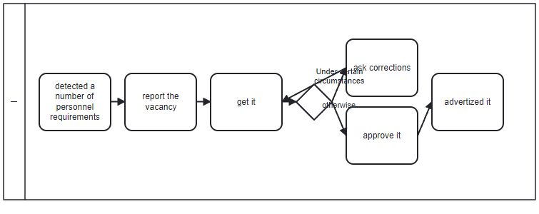

# Simple PET to BPMN conversion server

Proof of concept implementation of a process model generation algorithm, using PET as input
and BPMN as output. This code is part of our paper at ER conference 2024.

This project uses gradle as build tool.
Run `gradle standalone` to build the project.

Afterwards you can run the server with `java -jar build/libs/standalone-bpmn-layouter-1.0-SNAPSHOT.jar`.

You can send a POST request, containing a single PET documents in JSON format (see companion repository) 
in the body to http://localhost:8765/convert/json, the server will answer with a base64 encoded image 
(which you can view, e.g., at https://jaredwinick.github.io/base64-image-viewer/).

We recommend using Postman for communicating with the server.

You can also use the following endpoints:

- `convert/json/xml` to generate Camunda compatible bpmn (xml) files
- `convert/xml` to generate the diagram component of a Camunda bpmn file